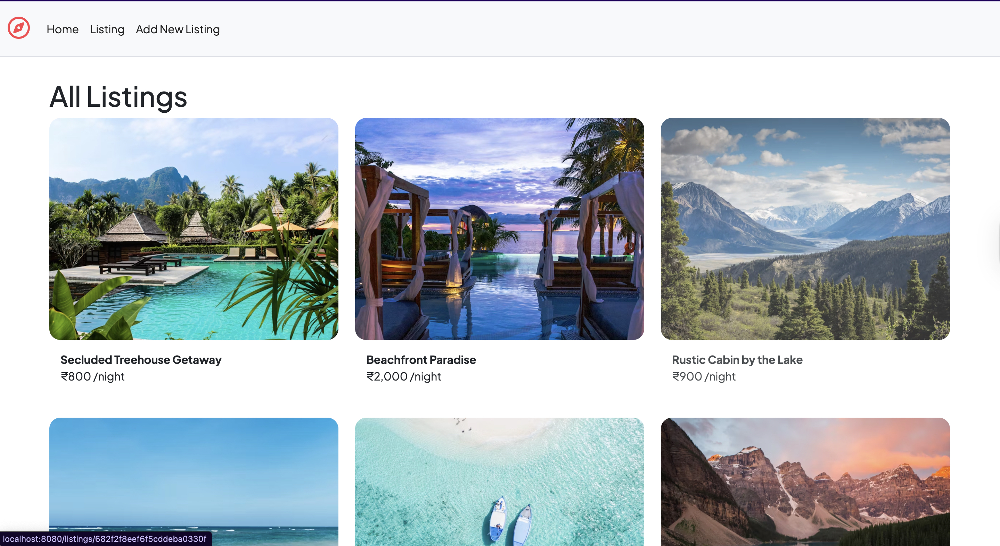
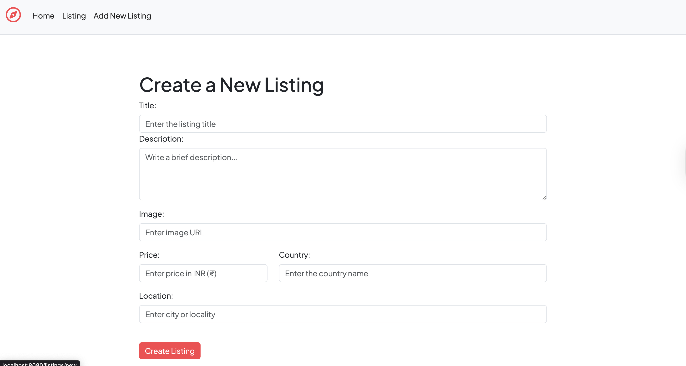
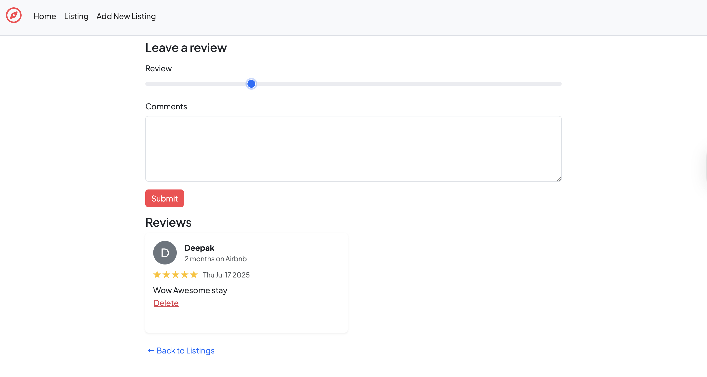

# Wanderlust - Airbnb Clone

## Screenshots

### Home Page


### New Listing Page


### Review Page


Wanderlust is a full-stack web application inspired by Airbnb, allowing users to browse, create, and manage property listings with user-generated reviews. Built with Node.js, Express, MongoDB, and EJS, it features CRUD operations for listings and reviews, robust error handling, and a clean, responsive UI.

## Features
- Browse all property listings
- View detailed listing pages with images and reviews
- Add, edit, and delete listings
- Leave reviews and ratings for listings
- Delete reviews
- Error handling for invalid routes and server errors

## Tech Stack
- **Backend:** Node.js, Express.js, MongoDB, Mongoose
- **Frontend:** EJS (with ejs-mate for layouts), Bootstrap 5
- **Other:** method-override, dotenv, custom error handling

## Getting Started

### Prerequisites
- [Node.js](https://nodejs.org/)
- [MongoDB](https://www.mongodb.com/)

### Installation
1. **Clone the repository:**
   ```sh
   git clone https://github.com/sehgalaayu/AirBnb-Clone-wanderlust.git
   cd AirBnb-Clone-wanderlust
   ```
2. **Install dependencies:**
   ```sh
   npm install
   ```
3. **Start MongoDB:**
   Ensure MongoDB is running locally on your machine (default port 27017).

4. **Run the app:**
   ```sh
   node app.js
   ```
   The app will be available at [http://localhost:8080](http://localhost:8080)

## Project Structure
```
AirBnb-Clone-wanderlust/
├── models/           # Mongoose models (Listing, Review)
├── public/           # Static assets (CSS, JS, images)
├── routes/           # Express route handlers
├── utils/            # Utility functions and error handling
├── views/            # EJS templates
├── app.js            # Main application file
├── package.json      # Project metadata and dependencies
└── README.md         # Project documentation
```

## License
This project is for educational purposes only and is not affiliated with Airbnb.
